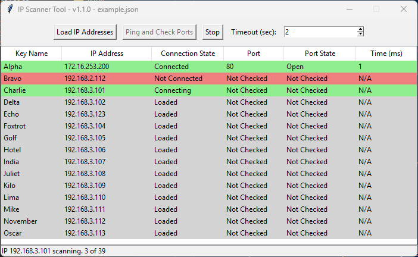

# IP Scanner Tool

A simple Python-based tool that uses `tkinter` to provide a GUI for pinging IP addresses and checking open ports. This tool allows users to load a configuration file with IP addresses and their respective ports, ping them, and verify their port availability.



## Features

- **Load IP Addresses**: Load a list of IP addresses from a `.json` configuration file.
- **Ping and Port Check**: Ping the IP addresses and check the specified ports for connectivity.
- **Timeout Customization**: Set a custom timeout duration for both the ping and port checks.
- **Status Feedback**: Visual feedback for the connection status of each IP and port.

## How to Use

1. **Install Required Libraries**:
   This tool uses the `tkinter`, `subprocess`, `socket`, `threading`, and `json` libraries, which are built into Python. No external libraries are required.
   
2. **Run the Application**:
   Clone or download the repository, then run the Python script:

   ```bash
   python main.py
   ```

3. **Load Configuration File**:
   Once the app is running, click on the **Load IP Addresses** button and select a `.json` file that contains the IP addresses and optional ports you want to scan.

4. **Start Scanning**:
   After loading the configuration, click the **Ping and Check Ports** button to start scanning. The results will be displayed in the table, with color-coded rows based on the success or failure of the ping and port check.

5. **Stop Scanning**:
   You can stop the scan anytime by clicking the **Stop** button.

## Configuration File

The configuration file should be in `.json` format, where each key is a descriptive name and the value is the IP address, optionally followed by the port number:

```json
{
  "Server 1": "192.168.1.10:80",
  "Server 2": "192.168.1.20",
  "Printer": "192.168.1.30:9100"
}
```

- If no port is specified, only the ping test will be performed.
- If a port is provided, both the ping and port tests will be performed.

## License

This project is licensed under the MIT License. See the `LICENSE` file for more details.
